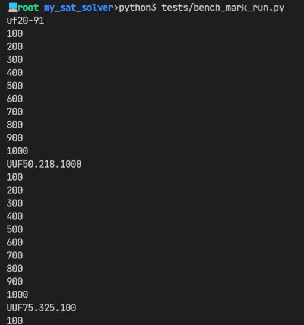
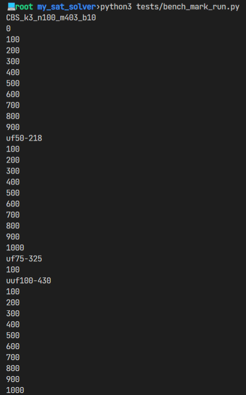

# README

Author: 袁玉润

> NOTE: see README.pdf for a better view of this document

## Introduction

This project realizes a Conflict-Driven Clause Learning SAT solver. A comprehensive explanation can be found [here](doc/CDCL.pdf). 

## Build & Run

```bash
$ make all
$ ./build/sat_solver
```

Usage: `sat_solver [file]`

```Bash
$./build/sat_solver tests/testcases/uf20-91/uf20-01.cnf 
[Implication Graph] L1 2 1 
[Implication Graph] L2 1 1 
[Implication Graph] L3 6 1 
...							# logs
[Implication Graph] L1 20 1 
[Implication Graph] L1 14 1 
[Implication Graph] L1 16 0 
2 = 1
1 = 0
6 = 0
...							# the assignments. 
... 						# Only shown if the result is SAT
10 = 1
13 = 0
12 = 0
SAT							# "SAT" or "UNSAT"
```

To have a less verbose output, redirect the error output: 

```bash
$./build/sat_solver tests/testcases/uf20-91/uf20-01.cnf 2>/dev/null
SAT
```

## Examples & Benchmarks

Several data sets from [SATLIB - Benchmark Problems (ubc.ca)](https://www.cs.ubc.ca/~hoos/SATLIB/benchm.html) are used for correctness check. The testcases are located at `tests/testcases/`. You can run the testcases with

```bash
$ python3 tests/benchmark_run.py
```

The execution can take a while. Configure `benchmark_run.py` to select a subset of the data sets to run.  





## Algorithms

The project is implemented with a typical CDCL algorithm: 

```c
if (unipropogate() == conflict)
    return UNSAT;
while(there is an unassigned variable){
    make a decision, increment the decision level;
    if(unipropagate() == conflict){
        if (current decision level == 0)
            return UNSAT;
        Clause learnt_clause = conflict_analysis(conflicted clause);
        back_jump(aimed_decision_level);
        add learnt_clause;
        unipropagate();
    }
}
return SAT;
```

### Unipropagation

`unipropage` assigns the variables that *must* be true or false under current decisions. This is done by searching for clauses such that only one literal is unassigned while other literals are false. The search can be done efficiently due to [ad hoc design of data structures](#Clauses). 

A conflict is detected if a variable is assigned with conflicting values via different unipropagation paths. 

### Conflict Analysis

To derive the learnt clause from the conflict, an [*implication graph*](#Implication Graph) is constructed and updated each time an assignment occurs (either during unipropagation or making decisions). A new clause is learnt via the following steps: 

#### Unit Implication Point

Let $\varphi=\bigvee_i^k l_i$ denote the conflicting clause. Let $DL(l)$ denote the decision level of literal $l$ (that is, at which decision level $l$ is assigned).  Let $n$ denote the current decision level, then we have $\max_i DL(l_i)=n$, otherwise the conflict should be detected before decision level $n$. 

1. Let $WorkList=\{l_1, l_2,\cdots, l_k\}$. 
2. If there is only 1 element in $WorkList$ that is on decision level $n$, then this element (literal) is a *dominator* in the implication graph. Returns. 
3. Else, pick $l$ from the $WorkList$ s.t. $DL(l)=\max_{t\in WorkList}\{DL(t)\}$. Replace $l$ with all the predecessors of $l$ in the implication. Go to 2. 

The learned clause is the disjunction of the negation of the literals in the final work list, i.e., $\text{Learnt Clause}=\bigvee_{l\in \text{WorkLlist}_{\text{final}}} \neg l$. 

#### Backjumping Decision Level

The decision level to which to jump is determined by the learned clause. 

* If there is only 1 literal in the learnt clause (and it of course is on level $n$), that means its assignment does not depend on any decisions made, and we should backjump to level $0$. 
* Otherwise, backjump to the highest level of the literals in the learnt clause except $n$: $\max_{DL(l)\neq n}{DL(l)}$. 

### Backjumping

Let $dl$ denote the decision level to which we backjump. 

Undo all the decisions made at decision level higher than $dl$, and unipropagate the learnt clause. Notice that there is one and only one literal in the learnt clause whose assignment is undone, that is, the one on the level $n$. So only 1 assignment would be made during this unipropagation. 

### Decision Policy

Currently the decision policy is to randomly pick an unassign variable and assign it `true`. A more sophisticated strategy may be integrated to this project in the future. 

### Conclusion

The structure of the algorithm resembles that of DPLL, with an exception that DPLL employs backtracking strategy upon a conflict while CDCL backjumps. The key is to **track back the assignments that finally lead to this conflict**, and avoid the conflict beforehand by clause learning. 

## Data Structures

### Clauses

Each disjunctive clause is represented by a data structure that records the literals in this clause categorized by the value of the literals: 

```c
struct Clause{
    HashSet true_literals;
    HashSet false_literals;
    HashSet unassigned_literals; 
}
```

Although there may be inconsistency problems without careful design, maintaining such information facilitate

1. the evaluation the value of the clause (e.g, a clause is evaluated `true` if and only if `!true_literals.empty()`), 
2. conflict detection (a conflict is detected if all the literals are in `false_literals`) and 
3. unipropagation (a clause would be added to the unipropagation queue if only 1 literal is in `unassigned_litrals` and others are in `false_literals`). 

### Implication Graph

This directed acyclic graph is organized in the topological order in a stack. The nodes are arranged in the order of when the assignment is made. 

The nodes can be classified into

1. the decision nodes, of which the assignment is made by decisions. Each decision node is the first node of that decision level. 
2. the unipropagation nodes, of which the assignment is made by unipropagation. 

A unipropagation node also records the clause from which the assignment derives, therefore connects with its predecessors in the implication graph. 

In order to efficiently locate the decision nodes in the stack, the offsets of the decision nodes are recorded in a vector, and can be fetched in constant time. 

## Acknowledgement

1. [Course Slides][http://staff.ustc.edu.cn/~huangwc/fm/4.2.pdf]
2. [Conflict-Driven Clause Learning SAT Solvers.pdf (slbkbs.org)](https://slbkbs.org/papers/Conflict-Driven Clause Learning SAT Solvers.pdf)
3. [Conflict Driven Clause Learning (cse442-17f.github.io)](https://cse442-17f.github.io/Conflict-Driven-Clause-Learning/)